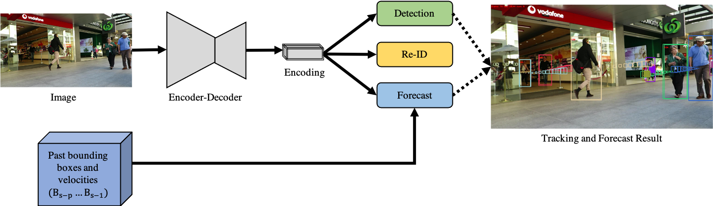

# JLA


We extend [FairMOT](https://github.com/ifzhang/FairMOT) with a forecast head to predict current and future objects locations:



> [**Multiple Object Tracking and Forecasting: Jointly Predicting Current and Future Object Locations**](https://arxiv.org/abs/2108.10543)

## Abstract

This paper introduces a joint learning architecture (JLA) for multiple object tracking (MOT) and multiple object fore- casting (MOF) in which the goal is to predict tracked ob- jects’ current and future locations simultaneously. MOF is a recent formulation of trajectory forecasting where the full object bounding boxes are predicted rather than trajecto- ries alone. Existing works separate multiple object track- ing and multiple object forecasting. Such an approach can propagate errors in tracking to forecasting. We propose a joint learning architecture for multiple object tracking and forecasting (MOTF). Our approach reduces the chances of propagating tracking errors to the forecasting module. In addition, we show, through a new data association step, that forecasting predictions can be used for tracking objects dur- ing occlusion. We adapt an existing MOT method to simul- taneously predict current and future object locations and confirm that JLA benefits both the MOT and MOF tasks.

## Installation
Run this after cloning repo:
```
conda create -n JLA
conda activate JLA
conda install pytorch==1.2.0 torchvision==0.4.0 cudatoolkit=10.0 -c pytorch
pip install -r requirements.txt

git clone https://github.com/CharlesShang/DCNv2
cd DCNv2
./make.sh
```

* In order to run the code for demos, you also need to install [ffmpeg](https://www.ffmpeg.org/).

## Data preparation
We use the same training data as [FairMOT](https://github.com/ifzhang/FairMOT).

* **Forecast Data**
To generate past and future data for training the forecast branch, run

```
cd src
python gen_past_bboxes.py
python gen_future_bboxes.py
```
## Training and Tracking
* Download the training data into data folder or soft link your root data directory to the data folder.
* Generate the forecast labels.
* To train on mix datasets (crowdhuman pre-trained model) and evaluate the performance, run:
```
sh experiments/mix_ft_ch_jla.sh
```

## Acknowledgement
A large part of the code is borrowed from [FairMOT](https://github.com/ifzhang/FairMOT). Thanks for their wonderful works.

## Citation

```
@article{kesa2021joint,
      title={Joint Learning Architecture for Multiple Object Tracking and Trajectory Forecasting}, 
      author={Oluwafunmilola Kesa and Olly Styles and Victor Sanchez},
      year={2021},
      eprint={2108.10543},
      archivePrefix={arXiv},
      primaryClass={cs.CV}
}
```

